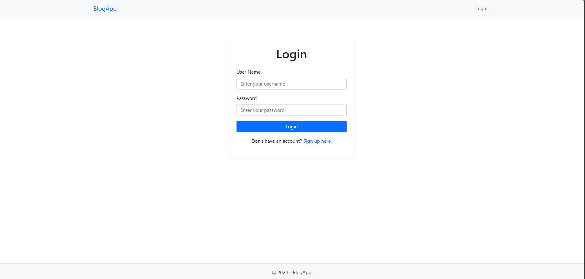
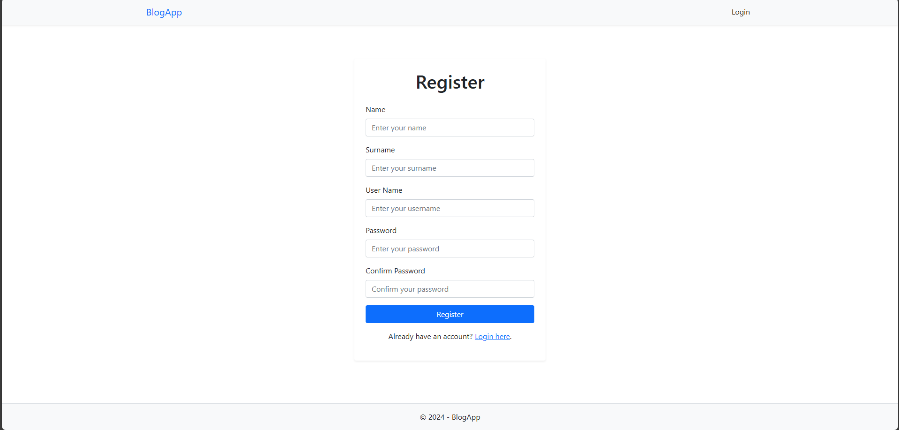
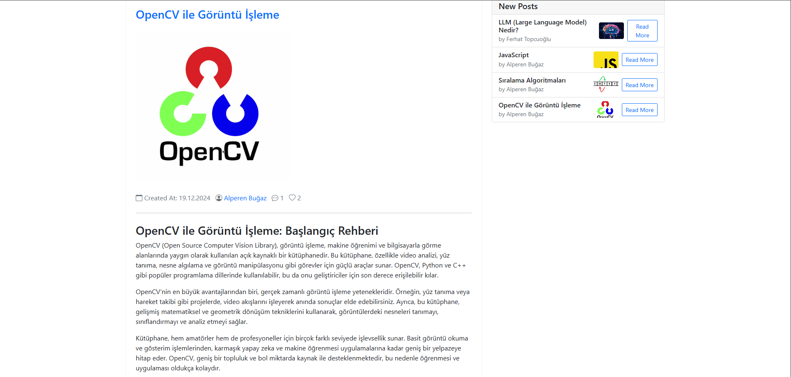
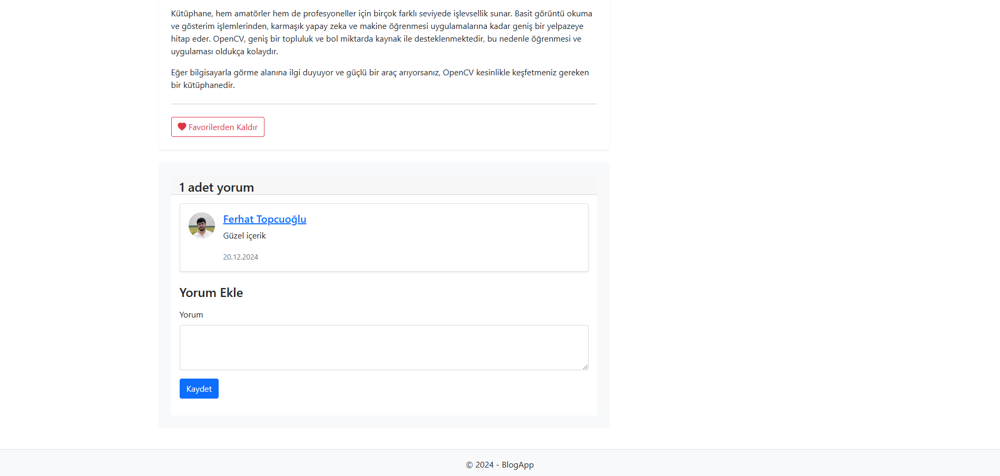
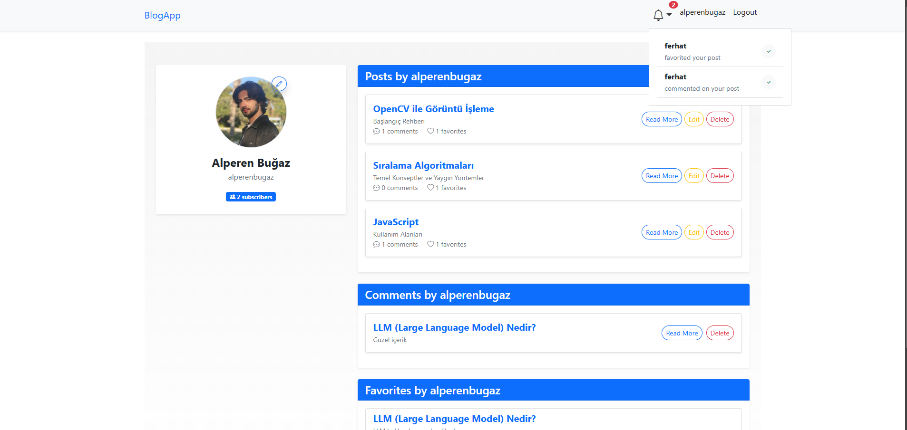

# Blog Uygulaması

Bu projede, kullanıcıların blog yazıları oluşturabileceği, düzenleyebileceği ve okuyabileceği bir blog uygulaması geliştirdim.

## Proje Amacı ve Genel Bakış

💻 **Asp.Net Core** kullanarak dinamik bir blog uygulaması geliştirmek.

📍 Projenin önyüzünde, kullanıcıların blog yazıları oluşturabileceği, düzenleyebileceği ve okuyabileceği bir tema kullanılmıştır. Kullanıcılar ayrıca diğer kullanıcılara abone olabilir, blog yazılarını favorilerine ekleyebilir ve yorum yapabilirler.

✅ Projeye bir **Admin Paneli** eklendi. Bu panel sayesinde admin rolündeki kullanıcılar, mevcut tüm işlemleri yönetebilir ve kullanıcılara, bloglara, rollere ve kategorilere ait **Ekle**, **Sil**, **Güncelle** ve **Listele** işlemlerini gerçekleştirebilir.

🔍 **Bloglar**, kategorilerine göre filtrelenebilir ve aynı zamanda blogların başlıklarına göre arama çubuğundan kolayca bulunabilir.

🔐 Kullanıcı ve rol yönetimi için ASP.NET Core **Identity kütüphanesi** kullanıldı. 

📚 **Bildirimler**, kullanıcıların bloglarına beğeni gelmesi, favorilere eklenmesi veya başka bir kullanıcının abone olması gibi durumlarda aktif hale gelir.

👤 **Kullanıcı profilleri**, kullanıcıların kaç aboneye sahip olduklarını, yayınladıkları blogları, favori bloglarını ve hangi bloglara yorum yaptıklarını gösterir.

🐋 **Veritabanı**, Docker ile ayağa kaldırıldı.

🔍 **Veritabanı olarak MySQL**, **ORM aracı olarak Entity Framework Core** kullanıldı.

📊 **Veritabanı Yönetimi** için **phpMyAdmin** uygulaması, Docker konteyneri içinde çalıştırılacak şekilde yapılandırıldı.

🚀 **Tablolar ve veritabanı**, **Code First** yöntemiyle ayağa kaldırıldı.

🔖 Sayfalar üzerinde **NavBar** ve **Sidebar** özellikleri ile sayfalar arası yönlendirmeler uygulandı.

## Özellikler

- Kullanıcı kayıt ve giriş işlemleri
- Blog yazısı oluşturma, düzenleme ve silme
- Blog yazılarına yorum yapma
- Kullanıcılara abone olma ve abonelikten çıkma
- Kullanıcı profili düzenleme
- Şifre değiştirme
- Dinamik bildirimler
- Admin paneli ile kullanıcı ve içerik yönetimi

## Kullanılan Teknolojiler

- **ASP.NET Core**
- **Entity Framework Core**
- **MySQL**
- **Docker**
- **Bootstrap** ve **Bootstrap Icons**
- **ASP.NET Core Identity kütüphanesi**


## Kurulum

### Gereksinimler

- .NET Core SDK (en az 5.0 sürümü)
- Docker (Veritabanı için)
- MySQL Server (Docker üzerinden otomatik kurulacak)
- Visual Studio veya Visual Studio Code (isteğe bağlı)

### Adımlar

   1. **Projeyi Klonlayın**
   ```bash
   git clone https://github.com/alperenbugaz/BlogApp.git
   cd BlogApp
   ```
   2. **Docker ile MySQL Veritabanını Çalıştırın**
   ```bash
   docker-compose up -d
   ```
   3. **Projenin Bağımlılıklarını Yükleyin**
   ```bash
   dotnet restore
   ```
   4. **Veritabanı Migrasyonlarını Uygulayın**
   ```bash
   dotnet ef database update
   ```
   5. **Uygulamayı Çalıştırın**
   ```bash
   dotnet run
   ```

   ## Konfigürasyon (Opsiyonel)
 1. **appsettings.json**
- ConnectionStrings alanında MySQL veritabanı bağlantı dizesini yapılandırabilirsiniz.

```json
  "ConnectionStrings": {
    "MySQLConnection": "Server=localhost;Port={PORT};Database={DB_NAME};User={User};Password={Password};"
  }
```
 2. **docker-compose.yml**
```docker
version: '3.8'

services:
  mysql:
    image: mysql:8.0
    container_name: {container_name}
    environment:
      MYSQL_ROOT_PASSWORD: {Password}
      MYSQL_DATABASE: {DB_NAME}
    ports:
      - "3306:3306" 
    volumes:
      - mysql_data:/var/lib/mysql
    networks:
      - my_network

  phpmyadmin:
    image: phpmyadmin/phpmyadmin
    container_name: {container_name}
    environment:
      PMA_HOST: mysql
      PMA_USER: {User}
      PMA_PASSWORD: {Password}
    ports:
      - "8080:80"
    depends_on:
      - mysql
    networks:
      - my_network

volumes:
  mysql_data:

networks:
  my_network:
```

### Görseller

1. **Login**


2. **Register**


3. **Bloglar**


4. **Blog Detay**



4. **Profil**
